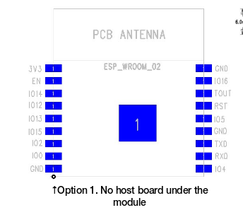

# vector-duck
Mittels dieses Projekt soll die Vector-Ente aus dem Strudel gebracht werden. 

# Informationen
Mikroboard: ESP-8266

# Setup Arduino IDE
Um das Board anzusprechen, muss es in der IDE hinzugefügt werden. Dazu folgendes einstellen: 

Unter `Datei - Voreinstellungen` folgende URL unter `Zusätzliche Boardverwalter` eingeben und mit OK bestätigen: `https://arduino.esp8266.com/stable/package_esp8266com_index.json`
Anschließend unter `Werkzeuge - Board - Boardverwalter` nach ESP suchen und den ESP8266 **installieren**.
Nach der Installation wiederum unter `Werkzeuge - Board ` das ESP-Board auswählen.

# PIN-Belegung
  

D-Ports | PCB-PIN | 
--------|---------------
D1      | I05 
D2      | I04
D3      | I00
D4      | I002
D5      | I014
D6      | I012
D7      | I013
D8      | I015
A0      | IOUT
RX      | RXD 
TX      | TXD